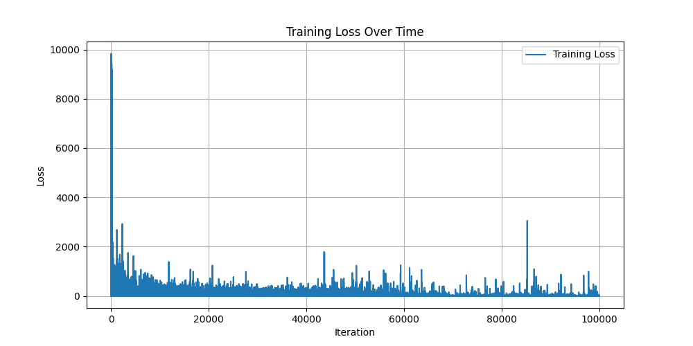
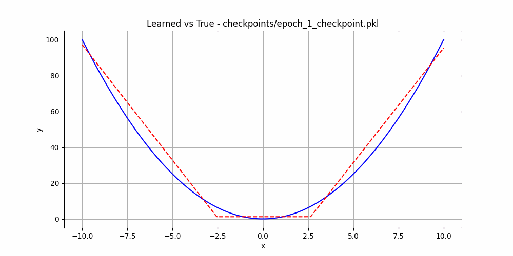

# LazyTorch!
A sequentially implemented, fully ready-to-train deep learning framework, all in *raw* python, with no external imports. Custom autodiff/autograd implementation, Tensor abstraction, feed-forward neural network, loss functions, activations, and more! Inspired by PyTorch. Lazy cause we don't do anything in parallel. Mainly made for my own (and now others'), learning! 

# The `Value` Class
* Main building block for autodiff/autograd
* Supports `add`, `subtract`, `multiply`, and `divide` operations
    * No other operations right now for simplicity, although any other operation can be constructed from these pretty much!
* All internal values are floats, no support for complex numbers
* Automatically accounts for mathematical operations with a scalar instead of another Value object
* All gradients automatically calculated upon operation (no `requires_grad` type toggle for simplicity)
* Calculated gradients are stored in each `Value` directly; must access `Value.gradient` to see them
* Like PyTorch, we cannot automatically zero out gradients and must use the `zero()` function to do so
* Multi-line operations are totally fine in line with the chain rule, however, changing of previous values will break the calculation graph

    * ```python
        # this is ok!
        a = Value(2.0)
        b = Value(3.0)
        f = b + b * a
        z = f * b
        z.backward()
        ```

    * ```python
        # this is not ok
        a = Value(2.0)
        b = Value(3.0)
        f = b + b * a
        b = b * a
        f.backward()
        ```

### Gradient Calculation Code Flow
We'll use addition as an example here for simplicity.
1. `Value` class instances are created with numerical values assigned to them. 
2. Upon instantiation we initialized the value itself, the gradient, a set `_dependents`, which will track the gradients used to calculate `self`'s gradient, and a function `_backprop`, which will be used to store the last gradient calculation function for a given operation. 
3. Two `Value` objects A and B are added together. 
4. The resulting value of a forward pass (calculation of addition) is returned as another `Value` object C.
5. The backward function for addition is set as the `_backprop` value on the output C. This backward function is where we define how to calculate gradients of the `Value` A as well as the `Value` B for addition (if we were not doing addition, it'd be for the other operation). The backward function also applies the gradient updates to both `Value` A and B. We must update the gradients of both to track the operation so they can flow through the chain rule during backpropagation.
6. The `_dependents` set of the output C is updated to be the `Value` A as well as the `Value` B. This is because both `Value` objects are responsible for calculating each other's gradient. This step builds the computation graph so we can track where each output came from, with the operations themselves as the nodes and the `Value`s as the edges pretty much.
7. We decide we want to find the gradients, so we call `.backward()` on the final output `Value` C. 
8. Starting with `Value` C, we use depth-first search to construct a list, from first operation -> last operation, of `Value` objects. This list represents all `Value` objects in the order they were used to perform the calculations that result in C, in this case, addition.
9. We set the gradient of C to be = 1. This must occur before backprop calculation, since we use this gradient in it. We are calculating all gradients with respect to the final output, which in this case is C, so this makes sense. In a deep learning scenario, this final output is typically the loss obtained from forward prop!
10. We reverse the depth-first list of `Value` objects, so it is now from last operated `Value` -> first operated `Value`. Iterating through this list, we call each `_backprop` function in each `Value`, which was set in step 5. Again, this represents the gradient calculation / setting of each gradient for the last operation occurring on the `Value`. This step is equivalent to calculating the chain rule.
11. To access the gradients of A, B, and C, all with respect to C, you will access `[A | B | C].gradient` to see it!

### Example Usage and Gradient Calculation:
```python
a = Value(2.0)
b = Value(3.0)
f = b + b * a
f.backward()
print(f'Gradient of a: {a.gradient}')
print(f'Gradient of b: {b.gradient}')
print(f'Gradient of f: {f.gradient}')
```

### Derivation:

Given the function:
$$ f = b + b \cdot a $$

Where:
- a = 2.0
- b = 3.0

First, we compute the value of f:

$$ f = b + b \cdot a $$
$$ f = 3.0 + 3.0 \cdot 2.0 $$
$$ f = 3.0 + 6.0 $$
$$ f = 9.0 $$

To find the gradient of f with respect to a, we take the partial derivative of f with respect to a:

$$ \frac{\partial f}{\partial a} = \frac{\partial}{\partial a} (b + b \cdot a) $$
$$ \frac{\partial f}{\partial a} = 0 + b $$
$$ \frac{\partial f}{\partial a} = b $$

Substituting b = 3.0:

$$ \frac{\partial f}{\partial a} = 3.0 $$

So, the gradient with respect to a is 3.0.

To find the gradient of f with respect to b, we take the partial derivative of f with respect to b:

$$ \frac{\partial f}{\partial b} = \frac{\partial}{\partial b} (b + b \cdot a) $$
$$ \frac{\partial f}{\partial b} = 1 + a $$

Substituting a = 2.0:

$$ \frac{\partial f}{\partial b} = 1 + 2.0 $$
$$ \frac{\partial f}{\partial b} = 3.0 $$

So, the gradient with respect to b is 3.0.

The gradient of f with respect to itself is 1:

$$ \frac{\partial f}{\partial f} = 1 $$

- The value of f is 9.0.
- The gradient of f with respect to a is 3.0.
- The gradient of f with respect to b is 3.0.
- The gradient of f with respect to itself is 1.

# The `Tensor` class
* Abstraction on top of the `Value` class
* Currently supports 2D matrices (so can do dense layers now)!!
    * Can support single values as a `Tensor` via `Tensor([[0]])`: this represents a tensor with a single value 0 contained in it
* Add and Subtract methods for both `Tensor` -> `Tensor` and `Tensor` -> scalar
* Division method for `Tensor` / scalar element-wise division
* Multiplication method for both matrix multiplication and element-wise multiplication, automatically detected
* Everything has autograd, with the gradients for all downstream `Tensor`s calculated with the `.backprop()` method
* Can get a matrix of equivalent size of a Tensor's gradients after some computation with the `.gradient()` function (useful for gradient updates)
* `.zero()` method will zero out all the gradients of a given Tensor
* Lack of `no_grad` functionality means if you're training a model, you must call the build-int `.zero()` method many times per gradient update to avoid many unnecessary accumulations

# `/examples/nn.py`: A ***fully trained*** neural network with LazyTorch!
* In `nn.py`, I trained a neural network that can approximate any polynomial function, using the code in this repo
    * For simplicity, I trained this to learn `x**2`
* Created LazyTorch-friendly ReLU and MSE Loss functions for activation and loss calculation
* Created an abstraction for a Dense Layer, complete with weights and biases
* Defined an entire neural network class, complete with gradient updates, forward prop, backprop, automatic dataset creation (since we're only approximating functions here), input shuffling, numerous epochs during training, .pkl-based checkpointing, and more
* Batching is not implemented yet, so the current setup treats the network as if `batch_size=1`; we can change this later
* In `nn_eval.py`, you can plot the learned function against the real function to see the results, and plot the loss over time as it decays
* NOTE: it is incredibly slow, since all matrix operations are calculated sequentially in the `Tensor` class; no parallelization is used here at all haha

### Graphs and Training
Here are some graphs showing LazyTorch learning `x**2`. You can see all the code I trained this with in `examples/nn.py`. Batch size is 1, hidden dim of 32, 1 input layer, 2 hidden layers, and 1 output layer (all dense), 0.0001 learning rate, 20 epochs, and learning between x = -10 and x = 10. The whole model took 1,320 seconds to train in total on my M2 Mac (not that hardware matters much, it's all sequential anyway). 



Training loss over time. Each "iteration" can be thought of as a batch with batch_size=1. Continues to decrease!



Timelapse of each epoch snapshot approximation of `x**2`. You can see how it learns over time!

# Conclusion
This repo is a fully working deep learning framework you can use to train your models without having to manually derive backprop for each layer. It's giga slow. But technically, you could train GPT-5 on this if you had enough time and patience. 
